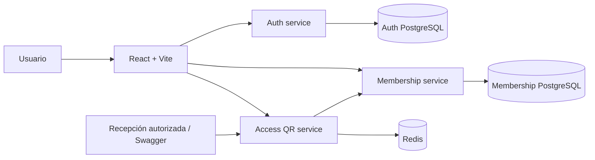
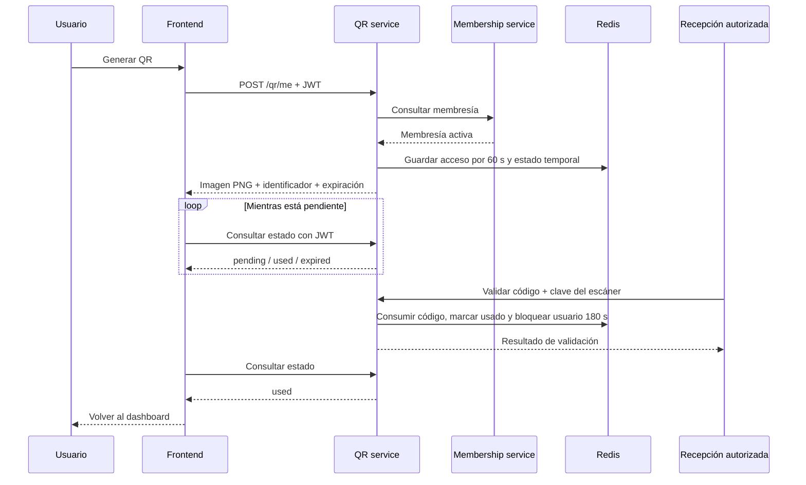
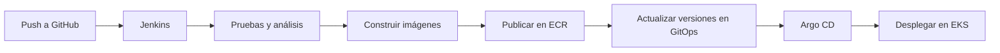

# Gym-LMF

### Gestión de membresías y acceso al gimnasio mediante QR de un solo uso

Un MVP con frontend React y tres microservicios Python, diseñado para desplegarse en AWS y automatizarse con Jenkins y Argo CD.


**Registro · Autenticación · Membresías · Acceso dinámico**

---

## Sobre el proyecto

Gym-LMF permite que un usuario consulte su información y membresía y genere un código QR temporal para acceder al gimnasio.

El QR contiene un código aleatorio, **no el JWT del usuario**. La validación se realiza en el backend y requiere autorización del escáner de recepción.

Este proyecto es un MVP académico. El flujo principal ha sido probado manualmente en el entorno local; el despliegue en AWS y la demostración del CI/CD son los siguientes objetivos.

## Funcionalidades

- Registro de usuarios con validación de contraseña.
- Inicio de sesión con JWT.
- Consulta del perfil del usuario autenticado.
- Consulta de plan, estado, costo y próxima fecha de pago de la membresía.
- Generación de QR para usuarios con membresía activa.
- QR con vigencia de **60 segundos** y uso único.
- Validación protegida mediante una clave de escáner.
- Consulta del estado del QR con autorización de su propietario.
- Regreso al dashboard tras una validación exitosa.
- Bloqueo de nuevos accesos durante **180 segundos** tras una entrada válida.
- Interfaz con modo claro y oscuro.

> La cámara normal de un teléfono solo lee el contenido del QR. Para registrar una entrada es necesario enviar el código a la API de validación desde un escáner autorizado. Actualmente se utiliza Swagger para esta demostración; la interfaz de recepción con cámara está pendiente.

## Arquitectura



| Componente | Responsabilidad | Puerto local |
|---|---|---:|
| Frontend | Registro, login, dashboard y QR | 5173, o el que indique Vite |
| Auth service | Usuarios, contraseñas y JWT | 8000 |
| Membership service | Consulta de membresías | 8001 |
| Access QR service | Generación, validación y estado del QR | 8002 |
| Auth PostgreSQL | Persistencia de usuarios | 5433 |
| Membership PostgreSQL | Persistencia de membresías | 5434 |
| Redis | Códigos temporales, estados y bloqueo de acceso | 6379 |

Los puertos de las bases de datos corresponden a su publicación local en Docker Compose. Dentro de los contenedores PostgreSQL utiliza el puerto 5432.

## Estructura del repositorio

```text
gym-mvp/
├── apps/
│   ├── admin-web/              # Frontend React + TypeScript
│   └── mobile/                 # Reservado; fuera del alcance actual
├── services/
│   ├── auth-service/
│   ├── membership-service/
│   └── access-qr-service/
├── infra/
│   ├── docker/                 # Compose y configuración de observabilidad
│   ├── kubernetes/
│   │   ├── base/
│   │   └── overlays/dev/
│   ├── argocd/                 # Definición de Application
│   └── terraform/              # Infraestructura AWS
├── docs/
├── protos/
├── Jenkinsfile
└── .gitignore
```

## Ejecución local

### Requisitos

- Docker con Docker Compose.
- Node.js y npm compatibles con la versión de Vite del proyecto.
- Git.
- Python compatible con cada servicio para ejecutar pruebas fuera de Docker.
- Configuración privada del backend: conexiones a las bases de datos, Redis y claves de autenticación.

### 1. Preparar la configuración

Configura los valores requeridos por `infra/docker/docker-compose.yml` y los archivos de configuración de cada servicio.

No se incluyen valores secretos en este README. Revisa `app/core/config.py` de cada servicio para conocer sus variables requeridas.

Para el frontend, crea `apps/admin-web/.env.local`:

```dotenv
VITE_AUTH_API_URL=http://localhost:8000
VITE_MEMBERSHIP_API_URL=http://localhost:8001
VITE_QR_API_URL=http://localhost:8002
```

Estas variables son URLs públicas de las APIs, **no secretos**. No pongas claves privadas, claves JWT ni la clave del escáner en variables `VITE_*`.

En el CORS de cada backend permite el origen exacto del frontend, incluido su puerto. Si Vite inicia en 5174, debe permitirse ese origen en lugar de asumir 5173.

### 2. Levantar el backend

Desde la raíz del repositorio:

```bash
docker compose -f infra/docker/docker-compose.yml up -d --build auth-service membership-service qr-access-service
```

Compose levantará las dependencias declaradas para esos servicios.

> El nombre de QR en Compose es `qr-access-service`; su carpeta se llama `access-qr-service`.

Consultar el estado y los logs:

```bash
docker compose -f infra/docker/docker-compose.yml ps
docker compose -f infra/docker/docker-compose.yml logs -f auth-service membership-service qr-access-service
```

### 3. Iniciar el frontend

```bash
cd apps/admin-web
npm ci
npm run dev
```

Abre la URL que indique Vite en la terminal. Si modificas `.env.local`, reinicia el servidor de desarrollo.

### 4. Preparar una membresía de demostración

Registrar un usuario **no crea automáticamente una membresía**.

Para la demostración local se asigna una membresía en la base de datos de membership usando el ID real obtenido en `GET /auth/me`. No uses un ID tomado de otro usuario.

La administración de membresías mediante una interfaz no forma parte del alcance actual.

## API principal

| Servicio | Método | Ruta | Autorización |
|---|---|---|---|
| Auth | POST | `/auth/register` | No requiere JWT |
| Auth | POST | `/auth/login` | No requiere JWT |
| Auth | GET | `/auth/me` | JWT |
| Membership | GET | `/memberships/me` | JWT |
| QR | POST | `/qr/me` | JWT y membresía activa |
| QR | GET | `/qr/status/{qr_id}` | JWT del propietario |
| QR | POST | `/qr/validate` | `X-Scanner-Api-Key` |

Documentación interactiva local:

- Auth: [localhost:8000/docs](http://localhost:8000/docs)
- Membership: [localhost:8001/docs](http://localhost:8001/docs)
- QR: [localhost:8002/docs](http://localhost:8002/docs)

## Flujo de acceso



- Un QR usado no puede reutilizarse.
- Un QR expirado no registra una entrada.
- El bloqueo de 3 minutos comienza tras un acceso exitoso.
- Un intento rechazado no reinicia el bloqueo.
- La retención del estado del QR no prolonga la validez del código.
- La decisión final de acceso siempre pertenece al backend.

## Pruebas y verificaciones

Cada microservicio utiliza su propio entorno virtual. Cambiar de carpeta no cambia el entorno activo.

Ejemplo para QR:

```bash
cd services/access-qr-service
source .venv/bin/activate
python -m pytest -q
```

Repite la ejecución en auth y membership con sus respectivos entornos y dependencias de prueba. Entre las dependencias utilizadas están `pytest` y `fakeredis`.

Verificar el frontend:

```bash
cd apps/admin-web
npm run build
```

Renderizar los manifiestos de Kubernetes sin desplegarlos:

```bash
kubectl kustomize infra/kubernetes/overlays/dev
```

### Pruebas manuales realizadas

- Registro y login desde el frontend.
- Consulta de perfil y membresía.
- Generación y visualización del QR.
- Rechazo de validación sin clave del escáner.
- Aceptación de un QR válido y rechazo al reutilizarlo.
- Rechazo de un QR nuevo tras su expiración.
- Redirección al dashboard tras la validación.

La ejecución completa de las pruebas automatizadas después de los últimos cambios, así como la verificación definitiva del bloqueo de 180 segundos, debe realizarse antes de la entrega. No se publican cifras de cobertura ni se afirma una ejecución exitosa del pipeline.

## AWS y CI/CD

### Estado actual

| Área | Estado |
|---|---|
| Flujo principal frontend + backend | Probado manualmente en local |
| Pruebas automatizadas | Añadidas; ejecución final pendiente |
| Docker | Imágenes y ejecución local verificadas |
| Kubernetes / Kustomize | Manifiestos preparados; despliegue pendiente |
| Terraform AWS | Configuración preparada; revisión y aplicación pendientes |
| Jenkins | Jenkinsfile preparado; instalación y ejecución pendientes |
| Argo CD | Application preparada; sincronización real pendiente |
| Escáner de recepción con cámara | Pendiente; validación demostrada en Swagger |

### Flujo de entrega objetivo



El Jenkinsfile preparado contempla pruebas Python por microservicio, análisis con Trivy y Semgrep y construcción de imágenes. La publicación en ECR y la actualización GitOps deben completarse y verificarse.

El frontend se plantea publicar mediante S3 y CloudFront. Los manifiestos del backend deben sustituir referencias como `ACCOUNT_ID` e `IMAGE_TAG` por imágenes reales antes del despliegue.

> Un commit local no dispara Jenkins. El flujo requiere un push y una integración configurada. Argo CD sincroniza los manifiestos; no ejecuta los stages de Jenkins.

## Seguridad y limitaciones

- No subir `.env`, claves privadas, credenciales AWS, claves del escáner ni estados o planes de Terraform.
- Rotar cualquier secreto expuesto en capturas, logs o historial de Git.
- No almacenar contraseñas ni JWT en logs.
- El JWT del frontend se guarda actualmente en `sessionStorage`; “Recordarme” conserva solo el correo.
- La clave del escáner permanece del lado del backend y de la recepción autorizada.
- Antes de publicar, revisar HTTPS, CORS y exposición de puertos.
- La implementación del bloqueo entre QR usa transacciones en Redis **sin modo clúster**. Debe adaptarse antes de usar Redis Cluster.
- No hay integración con torniquetes, pagos ni un escáner físico.
- Las validaciones actuales no equivalen a una auditoría de seguridad ni a preparación para producción.

## Objetivo de la entrega

Demostrar una aplicación accesible en AWS y un cambio visible desplegado mediante CI/CD:

1. Abrir la aplicación pública y ejecutar el flujo principal.
2. Realizar un cambio y enviarlo a GitHub.
3. Mostrar Jenkins ejecutando las verificaciones y publicando las imágenes.
4. Mostrar Argo CD desplegando la nueva versión.

---

**Gym-LMF · MVP académico**

